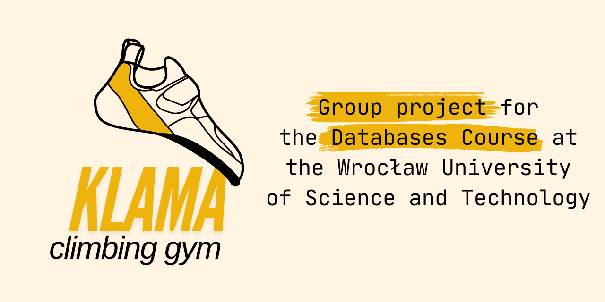

<p align="center">

</p>

# Klama - Climbing Gym - Database Project

KLAMA climbing gym is a group project for the Databases Course at the Wrocław University of Science and Technology.

Why KLAMA? 

KLAMA is a climbing institution made-up for the sake of the project. Each of the people working on it has an interest in bouldering therefore it was something familiar for us to have worked on. The word 'klama' itself is a slang used by the climbing community for a big, comfortable and often round climbing hold - also known as a jug.

## What can you do at KLAMA?

At KLAMA climbing gym you can buy passes with various durations, to then get inside the gym to climb on many boulder routes, that are routinely changed out to give you the most fun experience. KLAMA is friendly to newcomers! All of the needed equipment, from cheap magnesium to expensive shoes, can be both bought or rented.

KLAMA workers will be happy to walk anyone through the website where you can create an account and do all of that plus read the newest info such as special events happening soon. You can do a whole lot more from an employee perspective - the website allows you to do things such as managing users as well as uploading the blog posts. More on the specifics of that can be found in the BazyDanych_Specyfikacja-3.pdf file!

## How can you aquire the KLAMA website?

First of all - **clone the repository**. You can do it using the following command:
```bash
git clone https://github.com/xEdziu/KLAMA.git
```


Make sure you have Java >=21 installed. You can check that by running the following command:
```bash
java --version
```


Make sure you have MySQL server installed. You can install that from the official website: https://dev.mysql.com/downloads/mysql/

Next step is to add your own `application.properties` file in the `src/main/resources` directory. You can use the `application.properties.example` file as a template. You will need to provide your own database URL, username and password.

Here is the mentioned example file:
```properties
spring.application.name=Klama

# Connection to the database
spring.datasource.url=jdbc:mysql://localhost:3306/<DatabaseName>
spring.datasource.username=<username>
spring.datasource.password=<password>
spring.datasource.driver-class-name=com.mysql.cj.jdbc.Driver

# Configuration of the connection pool
# PRODUCTION
# spring.jpa.hibernate.ddl-auto=update
# TESTING
spring.jpa.hibernate.ddl-auto=create-drop
spring.jpa.show-sql=true
spring.jpa.properties.hibernate.format_sql=true

server.error.include-message=always
server.error.include-stacktrace=never
server.error.include-binding-errors=always

spring.jpa.open-in-view=true

spring.mail.host=<smtp.host.address>
spring.mail.port=<587 for TLS, 465 for SSL>
spring.mail.username=<smtp.username>
spring.mail.password=<smtp.password>
spring.mail.properties.mail.smtp.auth=true
spring.mail.properties.mail.smtp.starttls.enable=true
```

After you have set up the `application.properties` file, you can run the application using the following command:
```bash
./mvnw spring-boot:run # Linux
mvnw spring-boot:run # Windows
```

The application should be running on `localhost:8080`.
The default admin credentials are:
```
Username: Sample
Password: superSecretPassword
```

and the default user credentials are:
```
Username: eddy06
Password: agoral06
```

## Authors
- [Adrian Goral](https://github.com/xEdziu)
- [Mateusz Zubrzycki](https://github.com/ZuberRS03)
- [Paulina Szulc](https://github.com/szxxlc)
